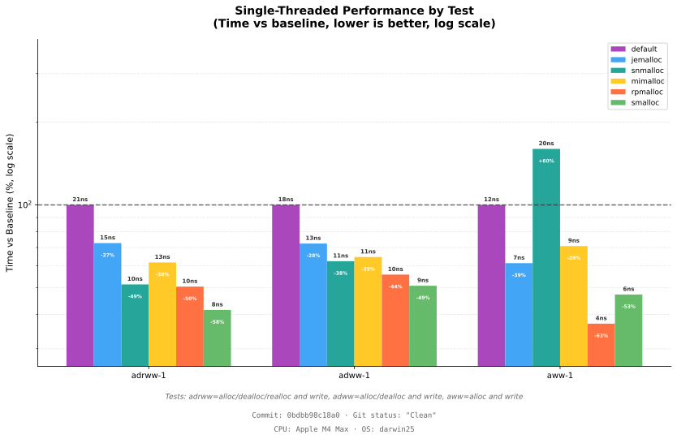
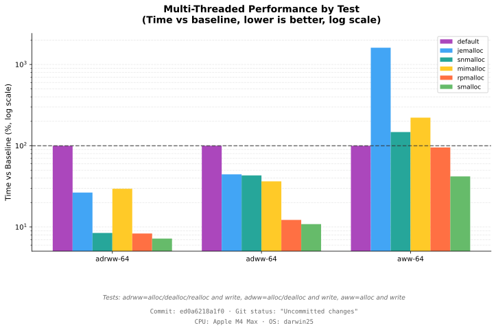

# Smalloc's bench tool

`smalloc` comes with a "micro-benchmarking" tool, used to measure `smalloc`'s performance at a low
level, which can also compare to low-level measurements of other allocators. Run it with

```
./runbench.sh
```

Example output: [results/AppleM4Max.darwin25/cargo-bench.result.txt](results/AppleM4Max.darwin25/cargo-bench.result.txt).






# Count Lines of Code

This is the one of the measurements that I was optimizing for.

```text
Allocator              Lines of Code
----------------------------------------
glibc                          7,384
jemalloc                      25,713
snmalloc                      12,728
mimalloc                      10,042
rpmalloc                       2,509
smalloc                          351
smalloc + ffi                    785
```

To count lines of code in various memory allocators using this methodology (mostly just excluding
debug asserts), use http://github.com/zooko/bench-allocators/ , which also produces colorful graphs
of allocator performance in a couple of workloads.

## Your Code Here

Make a script that runs benchmarks against your codebase, possibly following the examples of
https://github.com/zooko/rebar/blob/83f8713590c9f426303abccc8efb3c370cfe5441/bench-allocators.sh and
https://github.com/zooko/simd-json/blob/365e8a6a7824e66b895c173d9afe1e8127b22ad7/bench-allocators.sh
(if your code is in Rust) or
https://github.com/zooko/mimalloc-bench/blob/1a88cbd77a7e7d21248b33d5d0b31d925bbcd64c/bench-allocators.sh
(if your code is in C/C++/Zig/etc) and publish them and let me know by opening an issue or a
pull-request against this file!
